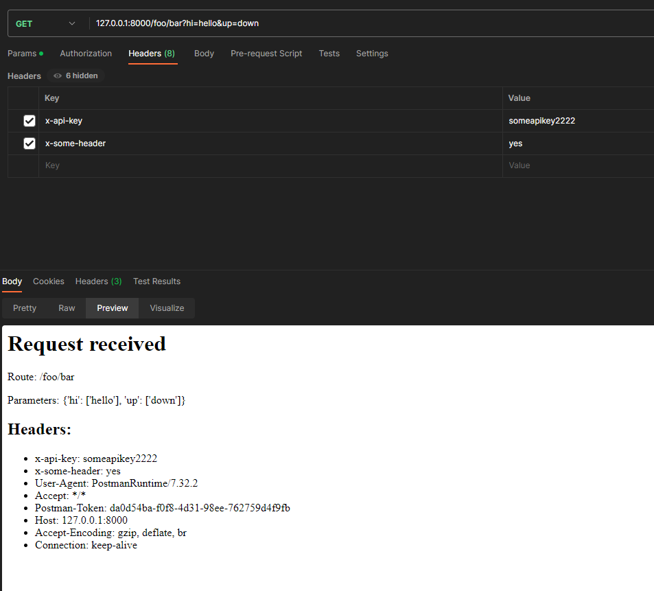

# PathRoutingDebugger

This project provides a simple HTTP server that helps with easy debugging of received parameters and HTTP headers. It is designed to be launched using Docker Compose, making it convenient to set up and use



## Usage

1. Clone the repository to your local machine.
2. Modify the docker-compose.yml file to customize the configuration if needed.

By default, the server runs on port `8000`. You can modify the port parameter in the run_server function in the `main.py` file to use a different port if needed.
3. Build and run the Docker containers using Docker Compose

```bash
docker-compose up -d
```
This command will build the Docker image based on the provided Dockerfile and start the container in the background.


Open your web browser and access the server at http://localhost:8000 (replace 8000 with the chosen port if modified in the docker-compose.yml file). You will see a simple HTML page with information about the received request.


The page displays the following details:

- Route: The URL path requested.
- Parameters: The query parameters received.
- Headers: The HTTP headers sent with the request.

Additionally, the server will print the received request details, including the route, parameters, and headers, in the console for debugging purposes.

To stop the Docker containers, run the following command:

```bash
docker-compose down
```

## Purpose

The Debug HTTP Request project was created to facilitate testing of URL path routing, particularly in conjunction with Traefik. By providing a lightweight server that displays the key information of each received request, it enabled me to easily inspect the rewritten routes, query parameters, and headers. 

This can be valuable when fine-tuning and verifying routing configurations in Traefik or similar systems.


## Contributions
Contributions to the Debug HTTP Request project are welcome! If you encounter any issues or have ideas for improvements, feel free to open an issue or submit a pull request.

